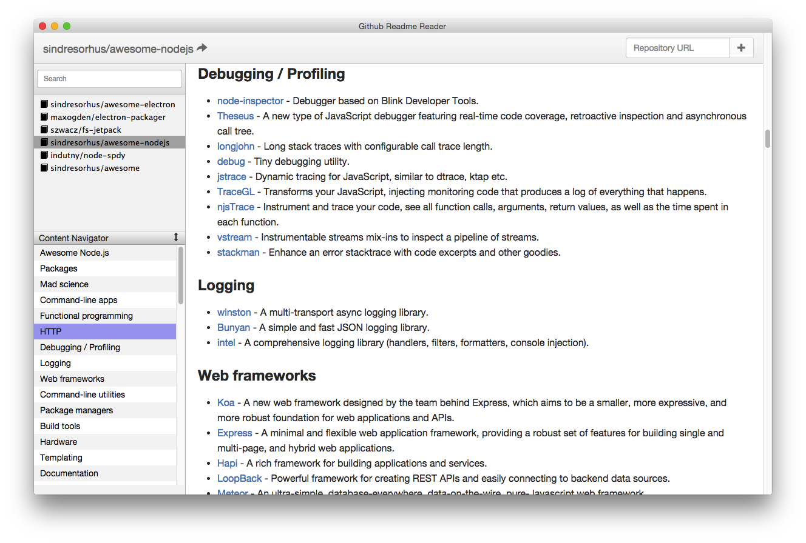

Github Readme Reader is a collector of readme documentations, you can use it to collect the readme documentations you want to read it.
All the Readme file will be downloaded on your local, you can read it at any where even you are offline.

#Usage

You need to install [Atom/Electron](https://github.com/atom/electron) first, then run it as Electron app.

```
// in app directory
npm install   // install dependencies
npm start     // start app
```

Add the repo readme documentation on the top.

## ScreenShot

